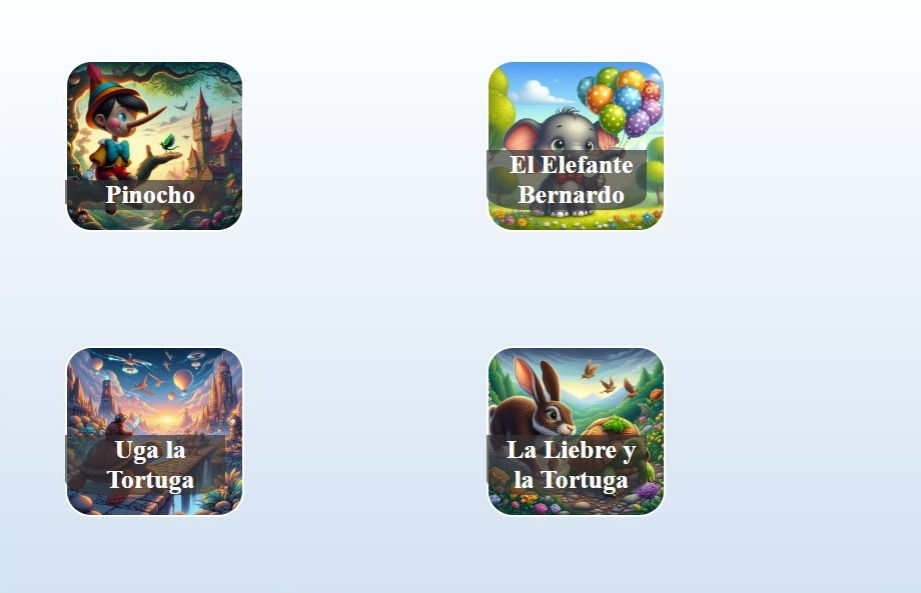
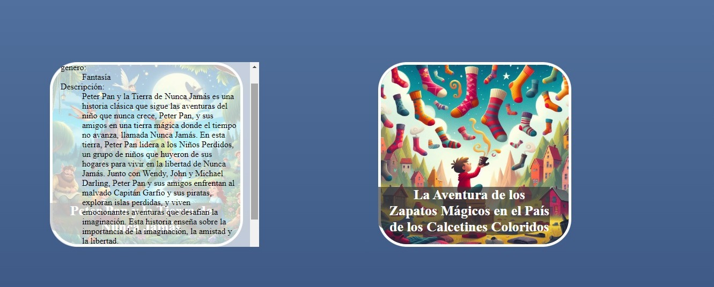
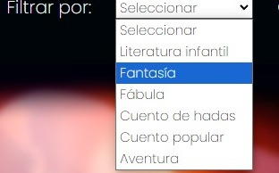
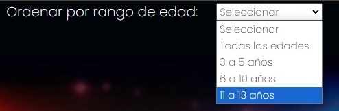
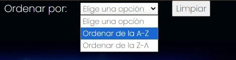

# Dataverse

## Índice

* [1. Introduccion](#1-Introduccion)
* [2. Prototipo ](#2-Prototipo)
* [3. ¿Como usar Cuantos Cuentos?](#3-¿Como-usar-Cuantos-Cuanetos?)
* [4. Ejemplos de filtrado](#4-Ejemplos-de-filtros)
* 
* [5. Instalacion](#5Instalacion)
* [6. Creditoso](#6Creditos)
* [7. Contacto](#7Contacto)
* [8. Estado de Proyecto](#8Estado-de-Proyecto)
* [9. Despedida](#9Despedida)

***

## 1. Introduccion

Bienvenido a Cuantos Cuentos, un lugar donde la magia de la lectura cobra vida y se convierte en una experiencia inolvidable para las madres y sus pequeños aventureros. En Cuantos Cuentos, nos dedicamos a hacer que la búsqueda y la exploración de cuentos sean simples y emocionantes, permitiendo que tanto los pequeños como los grandes encuentren rápidamente las historias perfectas para disfrutar juntos.

Nuestra página web ofrece una amplia variedad de cuentos, desde los clásicos que han resistido el paso del tiempo hasta los más populares en la actualidad. ¿Estás buscando sumergirte en los cuentos que han sido amados por generaciones? ¿O prefieres descubrir las últimas historias que están cautivando a los niños de hoy en día? Con Cuantos Cuentos, tienes la libertad de explorar y descubrir cuentos que se adapten a tus gustos y necesidades.

Utilizando nuestra herramienta de filtrado y visualización de datos, podrás navegar fácilmente a través de nuestra colección y encontrar los cuentos que más te interesan. ¿Quieres buscar por género, edad recomendada o tema? ¡No hay problema! Con solo unos pocos clics, podrás personalizar tu experiencia de lectura y descubrir nuevas aventuras que te encantarán.

Así que adelante, comienza tu viaje de lectura con Cuantos Cuentos y crea recuerdos mágicos con tus pequeños. Sumérgete en un mundo de imaginación y aventura, donde cada página es una nueva oportunidad para explorar, aprender y soñar juntos. ¡Bienvenido a Cuantos Cuentos, donde los cuentos cobran vida y las aventuras nunca terminan!

## 2. Prototipo

## 3. ¿Como usar Cuantos Cuentos?

* Bienvenida: Al acceder a Cuantos Cuentos, serás recibido con una cálida bienvenida en la parte superior de la página, que te invita a explorar una amplia selección de cuentos para niños y sus madres.

* Barra de filtros y Ordenamiento  En la parte superior de la página, encontrarás filtros intuitivos que te permiten refinar tu búsqueda según el género del cuento y el rango de edad recomendado para los lectores. Esto te ayuda a encontrar rápidamente los cuentos más adecuados para tus necesidades y preferencias.
Además de los filtros, tienes la opción de ordenar los cuentos de manera alfabética, ya sea ascendente (A-Z) o descendente (Z-A), lo que facilita aún más la navegación y la búsqueda de cuentos específicos.

* Explorar los Cuentos: En el cuerpo de la página, encontrarás una matriz de 24 tarjetas, cada una representando un cuento diferente. Al posicionar el cursor sobre una tarjeta, se mostrará información detallada del cuento, incluyendo el rango de edad recomendado, el género, una curiosidad y otras características destacadas.

* Interacción Intuitiva: Con esta presentación visual y la información detallada al posicionar el cursor sobre cada tarjeta, la página brinda una experiencia interactiva y envolvente tanto para las madres como para los pequeños. Pueden explorar los cuentos, descubrir nuevos favoritos y tomar decisiones informadas sobre qué historias leer juntos.

*
* ¡Y eso es todo! Con Cuantos Cuentos, la experiencia de encontrar y disfrutar de cuentos para niños se vuelve fácil, divertida y memorable para todas las familias.

## 4. Ejemplos de filtrado 
Con estas opciones de filtrado, encontrarás fácilmente los cuentos que se adaptan a tus preferencias y necesidades específicas, ¡permitiéndote disfrutar al máximo de la experiencia de Cuantos Cuentos!
* ¿Quieres sumergirte en un mundo de fantasía y magia? Selecciona el género "Fantasía" y descubre una selección de cuentos que te transportarán a tierras lejanas, llenas de criaturas mágicas y aventuras emocionantes.
  
* ¿Estás buscando cuentos adecuados para niños de 11 a 13 años? Utiliza el filtro de rango de edad y encuentra historias especialmente recomendadas para esta etapa de desarrollo, que desafiarán la imaginación y cautivarán la mente de tus hijos preadolescentes.
    
* Si tienes en mente el nombre de un cuento específico y deseas encontrarlo rápidamente, utiliza la opción de ordenar de manera ascendente. Simplemente introduce el nombre en el campo de búsqueda y selecciona la opción de ordenar de manera ascendente para encontrar el cuento deseado en la lista de resultados.

* ¿Quieres empezar de nuevo y explorar nuevas opciones? Utiliza el botón de limpieza para borrar los filtros aplicados y volver a la lista completa de cuentos. Esto te permite reiniciar tu búsqueda y explorar sin restricciones, para encontrar el cuento perfecto para ti y tus pequeños.
###  "¡Explora nuestra colección de cuentos y sumérgete en un mundo de imaginación y aventura! Personaliza tu experiencia de lectura seleccionando tus categorías favoritas y descubre nuevos cuentos para disfrutar juntos".

## 5. Instalacion
* Para empezar a disfrutar de la experiencia de Cuantos Cuentos, sigue estos simples pasos de instalación:
  1.-Clonar el Repositorio: Primero, asegúrate de tener Git instalado en tu sistema. Luego, clona el repositorio de Cuantos Cuentos desde GitHub a tu máquina local utilizando el siguiente comando en tu terminal:
  * **git clone https://github.com/tu_usuario/cuantos-cuentos.git**
  2.- Abrir el Proyecto en Visual Studio Code: Abre Visual Studio Code (VSC) y navega hasta la carpeta del proyecto que acabas de clonar. Puedes abrir la carpeta directamente desde VSC seleccionando "File" > "Open Folder" y eligiendo la carpeta del proyecto.
  3.-Instalar Dependencias: Una vez que tengas el proyecto abierto en VSC, abre la terminal integrada (puedes hacerlo seleccionando "Terminal" > "New Terminal") y ejecuta el siguiente comando para instalar todas las dependencias necesarias:
    * **npm install**
  4.-Ejecutar el Proyecto: Una vez que todas las dependencias se hayan instalado correctamente, puedes ejecutar el proyecto usando el siguiente comando en la terminal:
   * **npm satart**
  5.-Explorar Cuantos Cuentos: ¡Y listo! Ahora deberías poder acceder a Cuantos Cuentos a través de tu navegador web. Simplemente abre tu navegador favorito y visita la dirección http://localhost:3000 para empezar a explorar los cuentos y disfrutar de la experiencia interactiva tanto para las madres como para los pequeños.
     
 * ### ¡Y eso es todo! Ahora estás listo para sumergirte en el mundo de Cuantos Cuentos y disfrutar de la magia de la lectura con tus seres queridos.

   
## 6. Creditos
Queremos expresar nuestro sincero agradecimiento a todas las personas y proyectos que han contribuido al desarrollo y éxito de Cuantos Cuentos. Su dedicación, apoyo y talento han sido fundamentales para hacer realidad esta plataforma de cuentos interactiva y emocionante.

Yenny Alexandra  Castro Manjarrez: Por su invaluable ayuda en el diseño de la interfaz de usuario, que ha hecho que la experiencia de Cuantos Cuentos sea visualmente atractiva y fácil de usar.
Julieta Guadalupe Mora Angeles:Por sus valiosas contribuciones al código del proyecto, que han mejorado significativamente la funcionalidad y la eficiencia de Cuantos Cuentos.

Queremos expresar nuestro más sincero agradecimiento a equipo de Laboratoria, quienes generosamente brindaron su tiempo y conocimiento para proporcionar orientación y asesoramiento durante el desarrollo de Cuantos Cuentos. Su dedicación y apoyo fueron fundamentales para superar desafíos y resolver problemas técnicos, lo que contribuyó significativamente al éxito de este proyecto.

## 7. Contacto
 Correo:julietamoraangeles1@gmail.com
 *
 Correo:castroyenny74@gmail.com

## 8. Estado de Proyecto
* ### Versión Actual: 1.0.0

* ### Descripción:
*  Cuantos Cuentos se encuentra actualmente en su versión 1.0.0, que marca el lanzamiento inicial de la plataforma. En esta versión, ofrecemos una amplia selección de cuentos para niños y madres, con funcionalidades de filtrado intuitivas y una experiencia de usuario atractiva.
* ### Problemas Conocidos
* En la versión actual de Cuantos Cuentos, uno de los problemas conocidos es la limitación de aplicar solo un filtro a la vez. Actualmente, los usuarios no pueden aplicar simultáneamente múltiples filtros, como el filtro por género y el filtro por rango de edad, lo que puede dificultar la búsqueda de cuentos específicos que cumplan con múltiples criterios.

* Estamos conscientes de esta limitación y entendemos que poder aplicar múltiples filtros al mismo tiempo sería una mejora significativa para la experiencia de usuario. Estamos trabajando en una solución para permitir que los usuarios apliquen y combinen varios filtros de manera efectiva, lo que facilitará la búsqueda y la exploración de cuentos según sus preferencias individuales.

Apreciamos su paciencia y comprensión mientras trabajamos en resolver este problema y mejorar la funcionalidad de Cuantos Cuentos para brindar una experiencia aún mejor a nuestros usuarios.

### Actualizaciones Futuras Planeadas:

* En las próximas actualizaciones de Cuantos Cuentos, estamos comprometidos a abordar y mejorar la funcionalidad del filtro para brindar una experiencia más completa y satisfactoria a nuestros usuarios. Algunas de las actualizaciones planeadas incluyen:

* Corrección del Problema de los Filtros: Estamos trabajando activamente en una solución para permitir que los usuarios apliquen múltiples filtros simultáneamente. Esto incluirá la capacidad de combinar filtros, como el filtro por género y el filtro por rango de edad, para una búsqueda más precisa y eficiente de cuentos que cumplan con varios criterios.

* Optimización de la Interfaz de Usuario: Además de la corrección del problema de los filtros, planeamos realizar mejoras en la interfaz de usuario para hacer que la experiencia de navegación y búsqueda sea aún más intuitiva y atractiva. Esto incluirá mejoras en la presentación de los filtros y una mayor claridad en la aplicación de selecciones.

* Ampliación de la Biblioteca de Cuentos: Continuaremos agregando nuevos cuentos emocionantes y populares a nuestra biblioteca, ampliando así las opciones disponibles para nuestros usuarios y brindando una experiencia de lectura más enriquecedora.

### Estamos comprometidos a seguir escuchando los comentarios de nuestros usuarios y trabajar en mejoras significativas que hagan de Cuantos Cuentos la mejor plataforma posible para explorar y disfrutar de cuentos para niños. Estén atentos para futuras actualizaciones que reflejarán nuestro compromiso continuo con la excelencia y la satisfacción del usuario.

## 9. Despedida
*¡Gracias por visitar Cuantos Cuentos y explorar nuestra plataforma de cuentos interactiva! Esperamos que hayas disfrutado tu tiempo aquí y que encuentres muchos cuentos maravillosos para compartir con tus seres queridos.

Si tienes alguna pregunta, sugerencia o comentario, no dudes en ponerte en contacto con nosotros. Estamos siempre aquí para ayudarte y mejorar tu experiencia en Cuantos Cuentos.

¡Que tus aventuras de lectura sean emocionantes y llenas de magia! ¡Hasta pronto!
